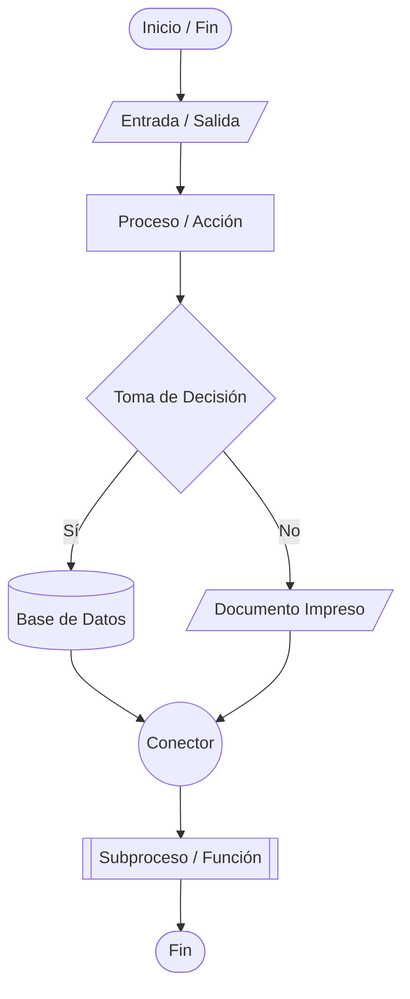

# Diagrama de Flujo o Flowchart

> Represemtación gráfica de un algoritmo por medio de símbolos relacionados que indican el orden de ejecución

Se caracterizan por

- Tener solo un punto de inicio y fin del programa

- Ejecutarse de arriba hacia abajo y de izquierda a derecha

Los símbolos para un **Diagrama de Flujo** son

